# YECMS — Yazaki Engineering Change Management System

A centralized web platform for tracking and managing **DFC** (Design Feasibility Change / Engineering Change Requests) and **Dérogations** (Engineering Change Orders) at **Yazaki Morocco Meknès (YMM)**.

Built as part of an academic partnership between YMM and ENSAM Meknès, this system digitizes the DFC lifecycle — from creation and feasibility assessment to derogation tracking — with real-time dashboards, AI-powered document import, and full audit traceability.

---

## Table of Contents

- [Screenshots](#screenshots)
- [Tech Stack](#tech-stack)
- [Features](#features)
  - [Authentication & Access Control](#authentication--access-control)
  - [DFC Management](#dfc-management)
  - [AI-Powered Document Import](#ai-powered-document-import)
  - [User Dashboard](#user-dashboard)
  - [Admin Dashboard](#admin-dashboard)
  - [User Management (Admin)](#user-management-admin)
  - [Reference Data Management (Admin)](#reference-data-management-admin)
  - [Audit Trail & History](#audit-trail--history)
  - [User Profile](#user-profile)
- [Project Structure](#project-structure)
- [Getting Started](#getting-started)
- [Environment Variables](#environment-variables)
- [Database](#database)
- [Glossary](#glossary)

---

## Screenshots

### Landing Page (Animated Hero)

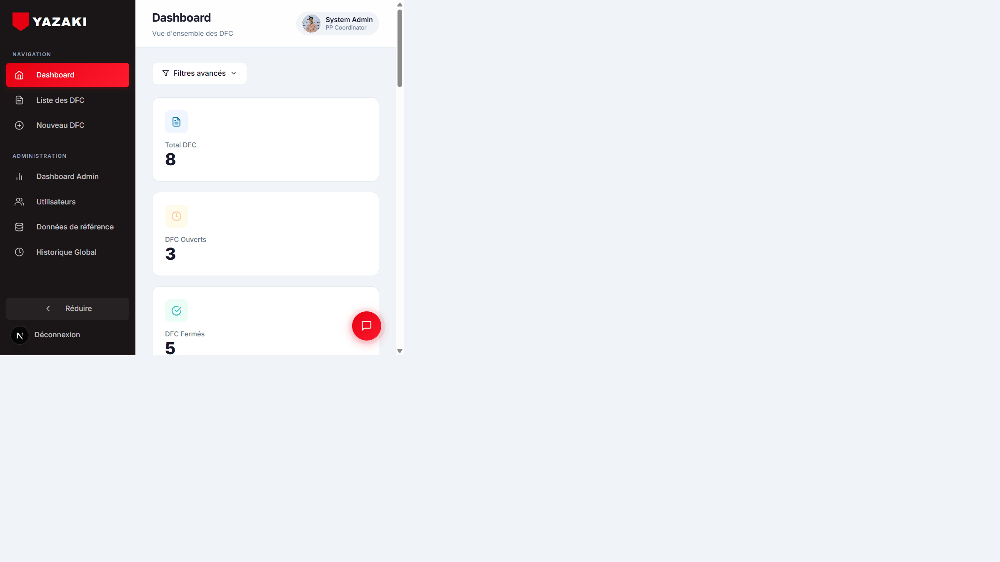

### Landing Page — Features

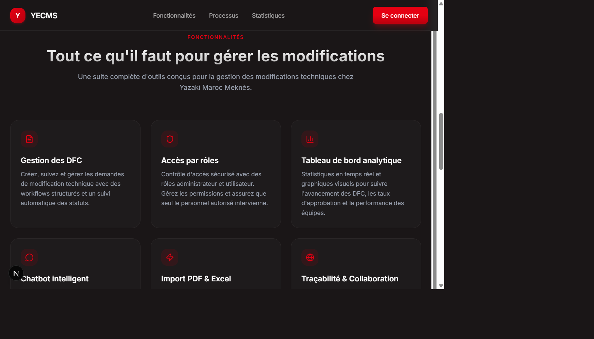

### Landing Page — Workflow

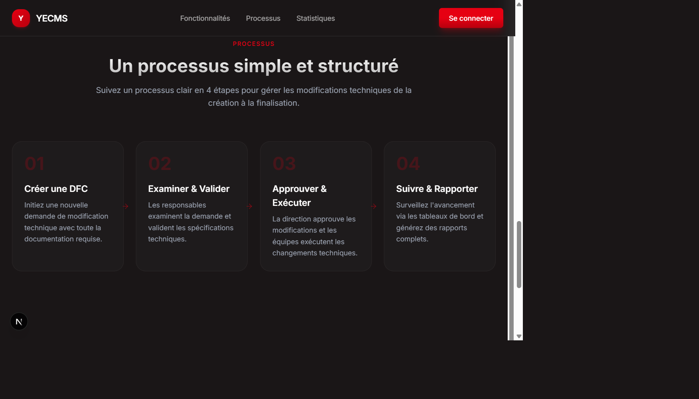

### Login

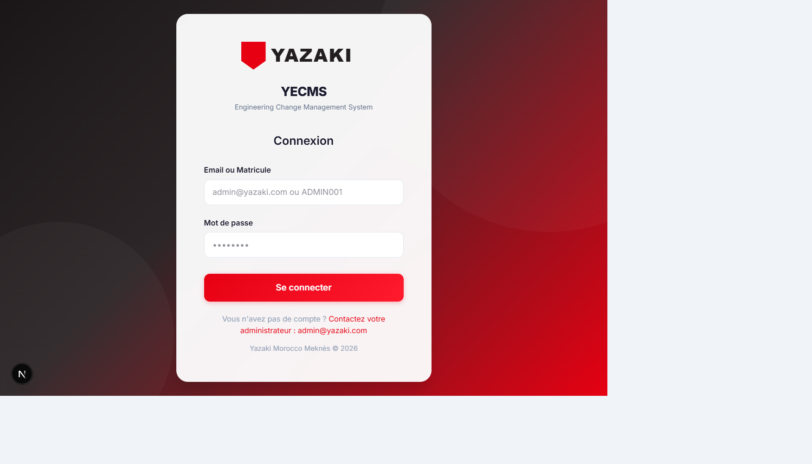

### User Dashboard

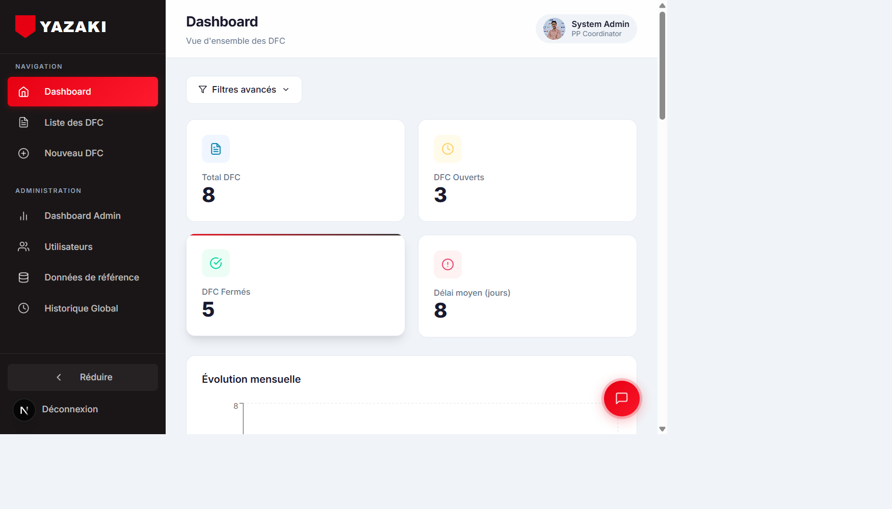

### DFC List

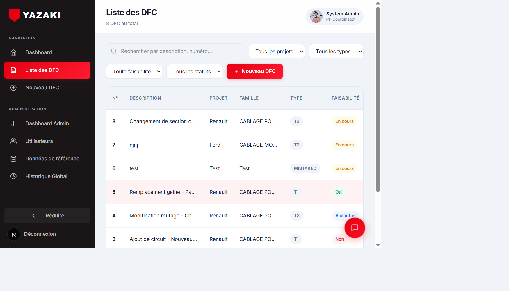

### DFC Detail

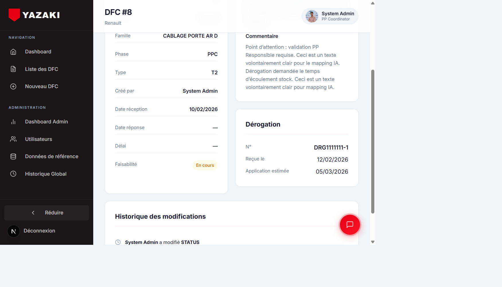

### New DFC Form

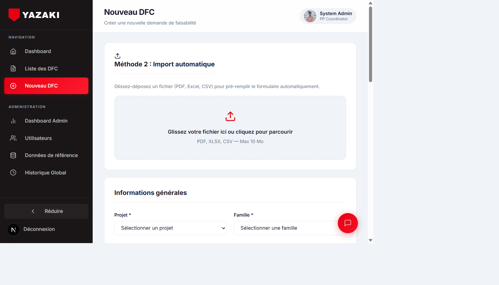

### Admin Dashboard

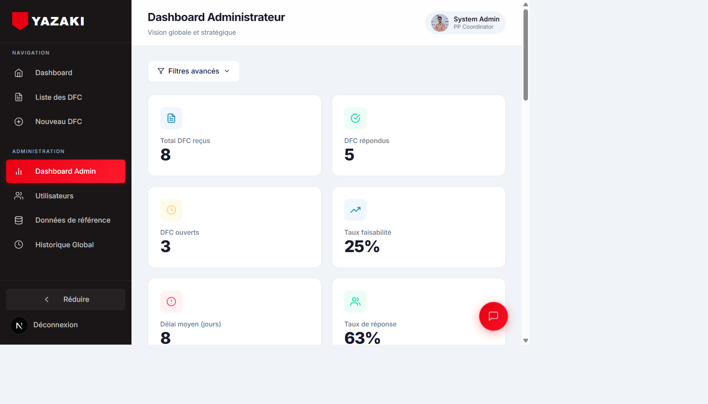

### Admin — User Management

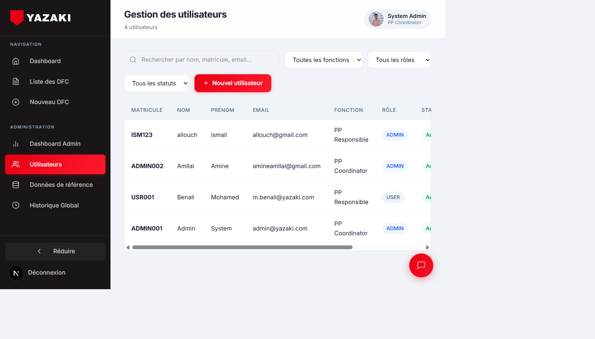

### Admin — Reference Data

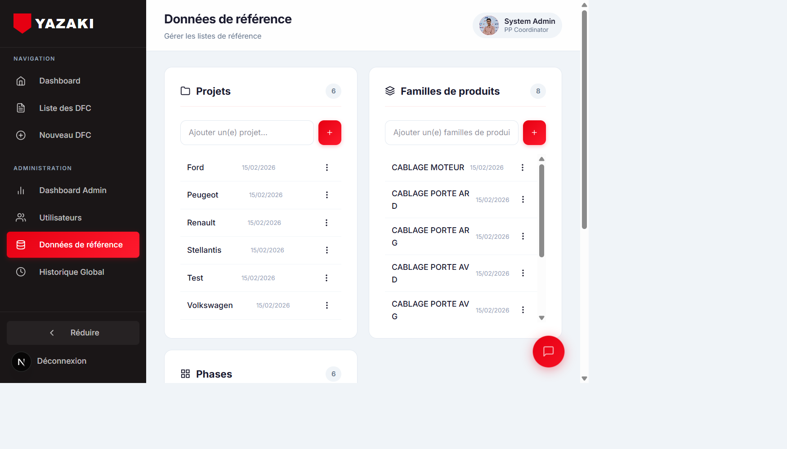

### Admin — Global History

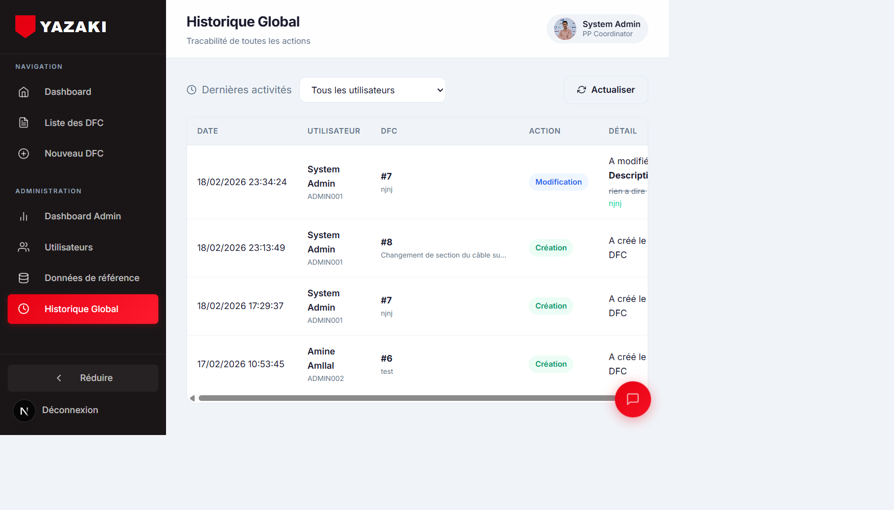

### User Profile

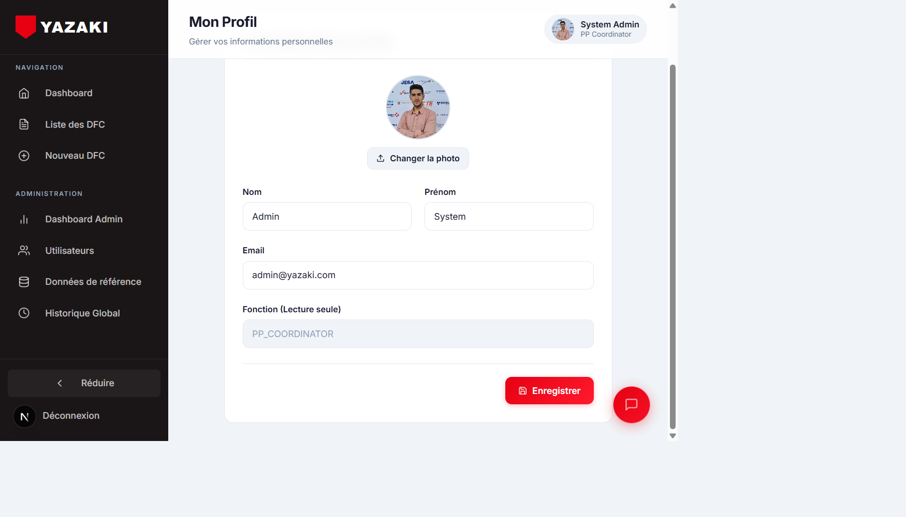

---

## Tech Stack

This project uses a **unified full-stack TypeScript** architecture — there is no separate backend server. Everything runs inside Next.js.

### Frontend

| Concern       | Technology                                           |
| ------------- | ---------------------------------------------------- |
| Framework     | [Next.js 16](https://nextjs.org) (App Router)       |
| UI            | React 19 (Server + Client Components)               |
| Charts        | [Recharts](https://recharts.org)                     |
| Icons         | [lucide-react](https://lucide.dev), react-icons      |
| Styling       | CSS Modules, [Tailwind CSS v4](https://tailwindcss.com) |
| 3D / WebGL    | [Three.js](https://threejs.org) (GLSL shaders)      |
| Fonts         | Geist (via `next/font`)                              |

### Backend (Next.js API Routes)

| Concern              | Technology                                                        |
| -------------------- | ----------------------------------------------------------------- |
| API                  | Next.js **Route Handlers** (`src/app/api/...`) — REST endpoints   |
| Language             | TypeScript                                                        |
| Runtime              | Node.js                                                           |
| Database             | **SQLite** (file-based) via [Prisma ORM](https://www.prisma.io)  |
| Authentication       | **NextAuth v5** (Credentials provider, JWT strategy, bcrypt)      |
| AI / LLM             | **Google Gemini 2.5 Flash** (`@google/genai`) — structured extraction |
| OCR                  | [Tesseract.js](https://tesseract.js.org) (French + English)      |
| PDF Rendering        | [MuPDF](https://mupdf.com) (PDF → PNG for OCR)                   |
| PDF Text Extraction  | **pdf-parse** (native text)                                       |
| Excel / CSV Parsing  | **xlsx**                                                          |
| Validation           | [Zod](https://zod.dev)                                            |

> There is **no Express, no Fastify, no separate backend process**. All server-side logic (OCR, PDF processing, Gemini API calls, database queries) runs as Next.js API routes in the `src/app/api/` directory.

### AI Service (RAG Chatbot)

A standalone Python Flask microservice providing an AI chatbot powered by **Retrieval-Augmented Generation (RAG)**.

| Concern           | Technology                                                        |
| ----------------- | ----------------------------------------------------------------- |
| Framework         | [Flask](https://flask.palletsprojects.com)                        |
| LLM               | **Google Gemini 2.5 Flash** (via LangChain)                       |
| Embeddings        | **Hugging Face Inference API** (`BAAI/bge-m3` model)              |
| Vector Store      | [ChromaDB](https://www.trychroma.com)                             |
| Orchestration     | [LangChain](https://python.langchain.com)                         |
| Database Access   | SQLite (read-only, shared with Next.js via Prisma `dev.db`)       |

The chatbot indexes all DFC records, history entries, and statistics from the SQLite database into ChromaDB, then uses RAG to answer user questions in French with precise, data-backed responses.

---

## Features

### Authentication & Access Control

- **Credentials login** — users sign in with their **email or matricule** and password.
- **Role-based access** — two roles: `USER` and `ADMIN`. Admin routes are protected server-side.
- **Route protection** — NextAuth middleware redirects unauthenticated users to `/login`.
- **Bcrypt password hashing** for secure credential storage.
- Active/inactive user enforcement — deactivated accounts cannot log in.
- **No self-registration** — only administrators can create user accounts.
- Login page displays: *"Vous n'avez pas de compte ? Contactez votre administrateur : admin@yazaki.com"*

### DFC Management

Full CRUD lifecycle for DFC records with the following fields:

| Field                           | Type            | Description                                               |
| ------------------------------- | --------------- | --------------------------------------------------------- |
| N° DFC                          | Auto-generated  | Unique sequential DFC number                              |
| Projet                          | Dropdown        | Associated project (from reference data)                  |
| Famille                         | Dropdown        | Product family (from reference data)                      |
| Phase                           | Dropdown        | Project phase (from reference data)                       |
| Description                     | Text            | Detailed DFC description                                  |
| Type du DFC                     | Dropdown        | T1, T2, T3, or Mistaked                                   |
| Date de réception               | Date            | Date the DFC was received                                 |
| Faisabilité                     | Radio           | OUI / NON / EN_COURS / A_CLARIFIER                        |
| Date de réponse                 | Date            | Feasibility decision date                                 |
| Délai de réponse                | Computed        | Days between reception and response                       |
| N° Dérogation                   | Text            | Derogation reference number                               |
| Date réception dérogation       | Date            | Derogation reception date                                 |
| Date d'application estimée      | Date            | Estimated implementation date                             |
| Date d'application dérogation   | Date            | Actual derogation implementation date                     |
| Commentaire                     | Text            | Free-form comments                                        |

**Capabilities:**

- **Create** — manual form entry or AI-assisted import (see below).
- **View** — detailed read-only page with all fields, creator info, and change history timeline.
- **Edit** — inline editing with all fields modifiable; changes are automatically tracked.
- **Delete** — with confirmation dialog.
- **Search & Filter** — text search, plus filters by project, type, feasibility, and open/closed status.
- **Pagination** — 15 DFCs per page.

### AI-Powered Document Import

Upload an existing DFC or Dérogation document and the system **automatically extracts and pre-fills** the form.

**Supported formats:** PDF (native text & scanned), Excel (.xlsx), CSV

**Extraction pipeline:**

1. **Excel / CSV** → parsed with the `xlsx` library.
2. **PDF (native text)** → extracted with `pdf-parse`.
3. **PDF (scanned / image-based)** → rendered to high-resolution PNG images via **MuPDF**, then OCR'd with **Tesseract.js** (French + English).
4. Extracted text is sent to **Google Gemini 2.5 Flash** with structured JSON output schema and reference data (projects, families, phases) for intelligent field mapping.
5. The form is pre-filled — the user reviews, corrects if needed, and validates.

**UI:** Drag-and-drop upload zone with visual states (idle, dragging, uploading, success, error) and an expandable preview of the extracted text.

### User Dashboard

Accessible at `/dashboard`. Provides operational KPIs and analytics:

**KPI Cards:**

- Total DFCs
- Open DFCs (awaiting response)
- Closed DFCs (with response)
- Average response time (days)

**Charts (Recharts):**

- Monthly trend — received vs. answered DFCs (line chart)
- DFC by type — T1 / T2 / T3 / Mistaked (pie chart)
- DFC by project (bar chart)
- DFC by feasibility (pie chart)

**Recent DFCs** table (last 5 entries).

**Advanced filters:** date range, project, family, DFC type, status, responsible user, feasibility.

### Admin Dashboard

Accessible at `/admin/dashboard`. Strategic-level view with enhanced metrics:

**KPI Cards:**

- Total DFCs received
- DFCs answered
- Open DFCs
- Feasibility rate (%)
- Average response time
- Response rate (%)

**Charts:** Same chart types as the user dashboard with donut-style pie charts.

**Advanced filters** — same filtering capabilities as the user dashboard.

### User Management (Admin)

Accessible at `/admin/users`. Full user lifecycle management:

| Field      | Description                                        |
| ---------- | -------------------------------------------------- |
| Matricule  | Unique employee identifier                         |
| Nom        | Last name                                          |
| Prénom     | First name                                         |
| Email      | Email address                                      |
| Fonction   | PP Responsible / PP Technician / PP Coordinator    |
| Rôle       | USER or ADMIN                                      |
| Mot de passe | Secure, bcrypt-hashed password                   |

**Capabilities:**

- Create users via modal form
- Edit user information
- Activate / Deactivate accounts (soft delete)
- Reset passwords
- View per-user activity history

### Reference Data Management (Admin)

Accessible at `/admin/settings`. Manage the dropdown lists used in DFC forms:

- **Projects** — add, rename, delete
- **Families** — add, rename, delete
- **Phases** — add, rename, delete

Deletion is blocked if a reference item is currently used by one or more DFCs (foreign key protection).

### Audit Trail & History

Complete traceability across the system:

- **Per-DFC history** — timeline of every field change (old → new value, user, timestamp), displayed on the DFC detail page.
- **Per-user history** — accessible from admin users page; shows all actions by a specific user (creations, modifications) with summary stats.
- **Global history** — admin-only view at `/admin/history`; filterable by user; full audit log across all DFCs and users.

### User Profile

Accessible at `/profile`. Users can:

- Edit their name and email
- Upload a profile photo (base64)
- View their assigned function (read-only)

### Landing Page

Public homepage at `/` — accessible without authentication. Features:

- **Animated hero section** with GLSL Hills 3D WebGL terrain background (Three.js + custom Perlin noise shaders)
- **Scroll-reveal animations** — sections fade/slide into view using IntersectionObserver
- **Staggered hero animations** — badge, title, paragraph, and CTA appear in cascading sequence
- **Feature showcase** — 6 cards: DFC management, role-based access, analytics dashboard, AI chatbot, PDF/Excel import, traceability & collaboration
- **Workflow section** — 4-step DFC lifecycle (Create → Review → Approve → Track)
- **Statistics banner** — key metrics (100% traceability, 4x faster processing, 24/7 access, zero paper waste)
- **Yazaki branding** — company colors (#E60012 red, #231F20 dark) throughout
- **French language** — entire page in French
- Single "Se connecter" CTA with admin contact message for account creation

### AI Chatbot (RAG)

Intelligent assistant connected to the DFC database:

- Natural language queries about DFCs, history, and statistics — answered in French
- RAG pipeline: SQLite → ChromaDB (vector indexing) → Hugging Face embeddings → Gemini LLM
- Endpoints: `/api/chat` (POST), `/api/health` (GET), `/api/reindex` (POST)
- Runs as a separate Flask service on port 5000

---

## Project Structure

```
src/
├── app/
│   ├── (main)/                  # Authenticated layout group
│   │   ├── dashboard/           # User dashboard
│   │   ├── dfc/                 # DFC list, detail, creation
│   │   ├── profile/             # User profile
│   │   └── admin/               # Admin-only pages
│   │       ├── dashboard/       # Admin dashboard
│   │       ├── users/           # User management
│   │       ├── settings/        # Reference data
│   │       └── history/         # Global audit trail
│   ├── api/                     # API routes
│   │   ├── auth/                # NextAuth handlers
│   │   ├── dfc/                 # DFC CRUD + import
│   │   ├── stats/               # Dashboard statistics
│   │   ├── users/               # User CRUD
│   │   ├── history/             # Audit history
│   │   ├── profile/             # Profile updates
│   │   └── reference/           # Reference data CRUD
│   └── login/                   # Login page
├── components/                  # Shared UI components
│   ├── ui/
│   │   ├── saa-s-template.tsx   # Landing page (hero, features, workflow, stats, footer)
│   │   └── glsl-hills.tsx       # Three.js GLSL terrain background
│   ├── Sidebar.tsx              # Collapsible navigation sidebar
│   ├── Header.tsx               # Page header with user badge
│   ├── DashboardFilters.tsx     # Dashboard filter controls
│   ├── FileImportUploader.tsx   # AI drag-and-drop uploader
│   ├── HistoryModal.tsx         # Change history modal
│   └── MainLayoutClient.tsx     # Layout shell
├── lib/
│   ├── auth.ts                  # NextAuth configuration
│   └── prisma.ts                # Prisma client singleton
└── middleware.ts                # Route protection middleware

AI-service/
├── rag.py                       # RAG chatbot Flask server
├── requirements.txt             # Python dependencies
└── chroma_db_yecms/             # ChromaDB vector store (auto-generated)

prisma/
├── schema.prisma                # Database schema
└── seed.ts                      # Seed data script
```

---

## Getting Started

### Prerequisites

- **Node.js** >= 18
- **npm** (or yarn / pnpm)

### Installation

```bash
# Clone the repository
git clone <repo-url>
cd yazaki_dashboard

# Install dependencies
npm install

# Set up environment variables
cp .env.example .env
# Edit .env with your values (see below)

# Initialize the database
npm run db:push

# (Optional) Seed with sample data
npm run db:seed

# Start the development server
npm run dev
```

### AI Service Setup

```bash
cd AI-service

# Install Python dependencies
pip install -r requirements.txt

# Start the RAG chatbot service
python rag.py
```

The AI service runs on [http://localhost:5000](http://localhost:5000).

**Requirements:** Python 3.10+, a Hugging Face API key (free), and a Google Gemini API key.

Open [http://localhost:3000](http://localhost:3000) to access the application.

### Available Scripts

| Command            | Description                          |
| ------------------ | ------------------------------------ |
| `npm run dev`      | Start development server             |
| `npm run build`    | Build for production                  |
| `npm run start`    | Start production server               |
| `npm run lint`     | Run ESLint                            |
| `npm run db:push`  | Push Prisma schema to database        |
| `npm run db:seed`  | Seed the database with sample data    |
| `npm run db:studio`| Open Prisma Studio (DB GUI)           |

---

## Environment Variables

Create a `.env` file in the project root:

```env
DATABASE_URL="file:./dev.db"
NEXTAUTH_SECRET="your-secret-key"
NEXTAUTH_URL="http://localhost:3000"
GEMINI_API_KEY="your-google-gemini-api-key"
HF_API_KEY="your-huggingface-api-key"
```

| Variable          | Description                                                     |
| ----------------- | --------------------------------------------------------------- |
| `DATABASE_URL`    | SQLite database file path                                       |
| `NEXTAUTH_SECRET` | Secret key for NextAuth JWT encryption                          |
| `NEXTAUTH_URL`    | Application base URL                                            |
| `GEMINI_API_KEY`  | Google AI Studio API key for Gemini (document import + chatbot) |
| `HF_API_KEY`      | Hugging Face API token for embeddings (AI chatbot service)      |

> Get a free Gemini API key at [https://aistudio.google.com/app/apikey](https://aistudio.google.com/app/apikey)
>
> Get a free Hugging Face token at [https://huggingface.co/settings/tokens](https://huggingface.co/settings/tokens) (only "Inference" permission needed)

---

## Database

The app uses **SQLite** with **Prisma ORM**. Schema models:

- **User** — employee accounts with role (USER/ADMIN), function, and active status.
- **Project / Family / Phase** — reference data for DFC categorization.
- **DFC** — core entity with all DFC fields, linked to project, family, phase, and creator.
- **DFCHistory** — audit log tracking every field change per DFC (field, old value, new value, user, timestamp).

To explore your data visually, run:

```bash
npm run db:studio
```

---

## Glossary

| Term              | Definition                                                                                  |
| ----------------- | ------------------------------------------------------------------------------------------- |
| **DFC / ECR**     | Design Feasibility Change / Engineering Change Request — formal request to modify a component or assembly |
| **ECO / Dérogation** | Engineering Change Order — approved change order                                         |
| **PP**            | Product Preparation                                                                          |
| **KPI**           | Key Performance Indicator                                                                    |
| **T1 / T2 / T3** | DFC classification types                                                                     |
| **Mistaked**      | DFC classification for erroneous requests                                                    |
| **YMM**           | Yazaki Morocco Meknès                                                                        |
| **YECMS**         | Yazaki Engineering Change Management System                                                  |
